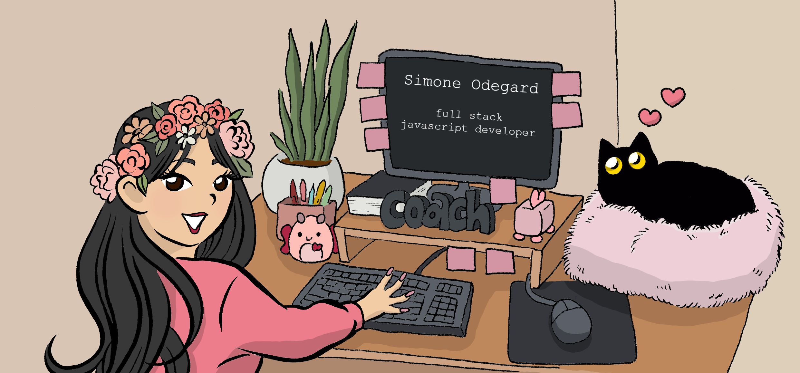

## ✨ If I'm shining everybody gonna shine ♫

Hi, I’m Simone Odegard (she/her). I’m a full stack JavaScript developer and I lead competitive dance teams. I believe that if you work hard, you will be successful even if you sometimes feel incapable. I want to inspire other young women to follow their dreams and be confident in their ability to succeed in tech.

As a dance coach, I have been responsible for creating award winning teams. I love working with people and I love helping them grow. It’s an amazing feeling when you’re able to achieve greatness, and even better when you can achieve that together. I want to join a work environment where others are passionate about their career, value growth, and where creativity is embraced. What I add to any team is positivity, encouragement, and hard work.

- 🔭 I’m currently working on rebuilding Recipe Roulette in React
- 🌱 I’m currently learning data structures and algorithms
- 📫 How to reach me: Simone.Odegard@gmail.com

 

